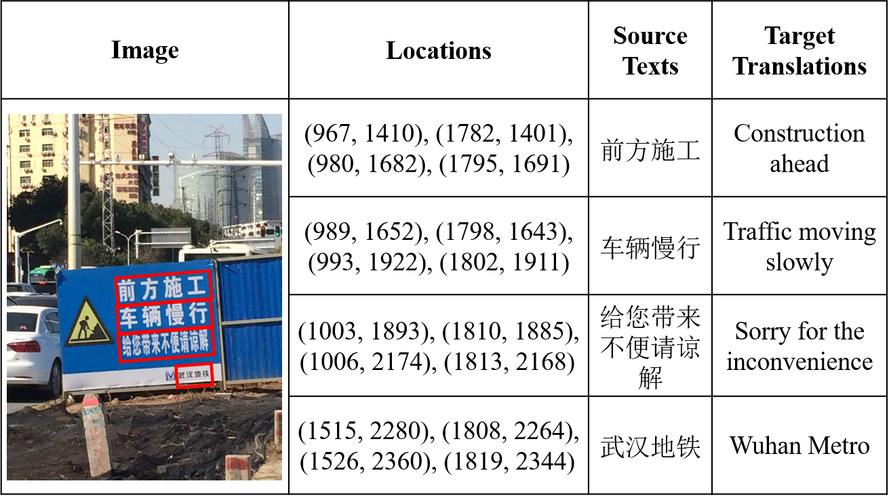

# OCRMT30K Data

OCRMT30K is based on five commonly-used Chinese OCR datasets: RCTW-17 (Shi et al., 2017), CASIA-10K (He et al., 2018),ICDAR19-MLT (Nayef et al., 2019), ICDAR19-LSVT (Sun et al., 2019) and ICDAR19-ArT (Chng et al., 2019).

Here is an example of the OCRMT30K dataset. The Locations are annotated by drawing bounding boxes to surround every text line.


## v2.0
The main folder `v2.0` contains whole_image_v2/after_proprecess/raw_data sets, which are made up by the following files :
```
v2.0/
├── whole_image_v2 //put the image file here
├── after_proprecess
    └──after_tok_bpe
        └── image_test.txt //each line corresponds to an image name.
        └── image_train.txt
        └── image_valid.txt
        └── test.tok.lower.en //each line corresponds to an English translation text.
        └── test.tok.lower.zh //each line corresponds to a Chinese text recongined by ocr.
        └── test.tok.lower.zh-c //each line corresponds to a labeled Chinese text.
        └── train.tok.lower.en
        └── train.tok.lower.zh
        └── train.tok.lower.zh-c
        └── valid.tok.lower.en
        └── valid.tok.lower.zh
        └── valid.tok.lower.zh-c
    └──before_tok_bpe //The data before tokenize and bpe
├── raw_data //The raw ocr labeled data,including locations and Chinese texts embedding in each image.
```

The images can be get here. [whole_image](https://docs.google.com/forms/d/e/1FAIpQLSfghS7K1sf5leRA_Xh0pQRsuqmrNMuyUAYkYh2bBRa0NfAh6w/viewform?usp=sf_link)

```
├── whole_image // containing images with ID being the image filename (0,1,2, etc)
      └── OCRMT30K_00000.jpg
      └── OCRMT30K_00000.jpg
      └── ...
```

## v1.0
We also release the v1.0 data, which is the original data used in our paper. We make further manual corrections based on v1.0 to build v2.0 data. We highly recommand v2.0 data.

## Proprecess code
We release the proprecess code, If you want to proprecess the raw data, you need to install the paddleocr(https://github.com/PaddlePaddle/PaddleOCR) first, and then run the `ocr_proprecess.sh`